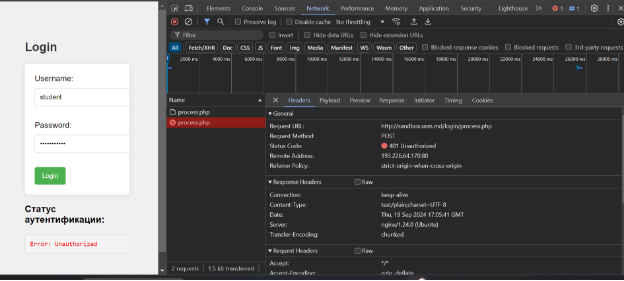
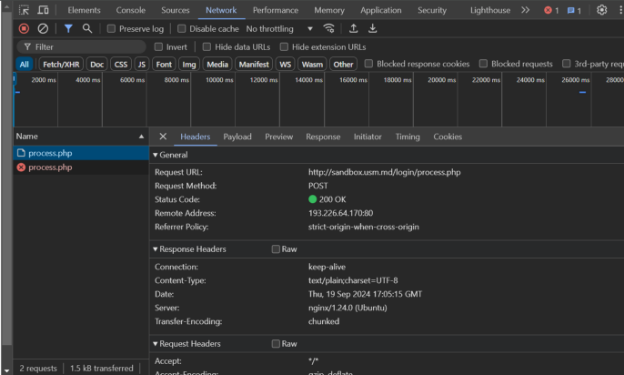
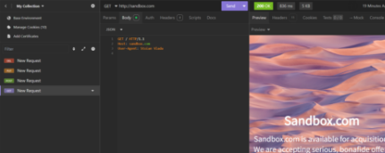
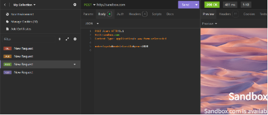
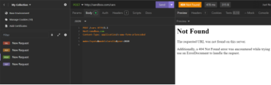
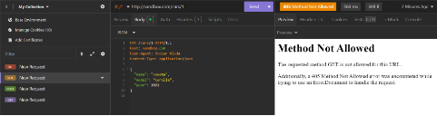
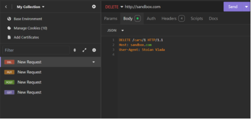

**UNIVERSITATEA DE STAT DIN MOLDOVA**

**FACULTATEA „MATEMATICĂ ŞI INFORMATICĂ”**

**DEPARTAMENTUL“INFORMATICĂ APLICATA”**


**Framework**


`              		            `Realizat : Stoian Vladimira

`              	               `Grupa: IA2201

`    	      		               `Verificat: Nichita Nartea

Chişinău 2024

**Sarcina nr.1. Analiza cererilor HTTP**

**Date introduse incorrect:**



1) Ce metodă HTTP a fost utilizată pentru a trimite cererea?

Codul de stare returnat de server este 401 Unauthorized, ceea ce înseamnă că autentificarea nu a reușit deoarece credențialele furnizate (username și password) nu sunt valide. Metoda HTTP utilizată pentru a trimite cererea de autentificare este POST. Aceasta metodă este folosită pentru a trimite date către server, mai ales când se transmit informații sensibile, cum ar fi datele de autentificare (username și password).

2) Ce anteturi au fost trimise în cerere? 

   ·  Connection: keep-alive
   ·  Content-Type: text/plain; charset=UTF-8
   ·  Date: Thu, 19 Sep 2024 17:05:41 GMT
   ·  Server: nginx/1.24.0 (Ubuntu)
   ·  Transfer-Encoding: chunked

3) Ce parametri au fost trimiși în cerere?

username: student
password: studentpass

4) Ce cod de stare a fost returnat de server?

A fost returnat codul de stare 401 Unauthorized
**

**Date introduse correct:**

**

1) Ce metodă HTTP a fost utilizată pentru a trimite cererea?

Metoda HTTP utilizată pentru a trimite cererea de autentificare este POST. Aceasta metodă este folosită pentru a trimite date către server, mai ales când se transmit informații sensibile, cum ar fi datele de autentificare (username și password).

2) Ce anteturi au fost trimise în cerere?

Connection: keep-alive
Content-Type: text/plain; charset=UTF-8
Date: Thu, 19 Sep 2024 17:05:15 GMT
Server: nginx/1.24.0 (Ubuntu)
Transfer-Encoding: chunked

3) Ce parametri au fost trimiși în cerere?

username: admin
password: password

4) Ce cod de stare a fost returnat de server?

A fost returnat codul de stare 200 OK
**

--
**Sarcina nr.2.**

1. Cererea GET
   Cererea GET este folosită pentru a solicita date de la un server.

   

```http
  GET / HTTP/1.1
   Host: sandbox.com
   User-Agent: Stoian Vlada
```
3. Cererea POST
   Cererea POST este utilizată pentru a trimite date către server.
   
   
   
   Aici daca scrim …/cars
   
   #
   
```http
   POST /cars HTTP/1.1
   Host: sandbox.com
   Content-Type: application/x-www-form-urlencoded

   make=Toyota&model=Corolla&year=2020
```

5. Cererea PUT
   Cererea PUT este utilizată pentru a actualiza datele pe server.

 

```http
PUT /cars/1 HTTP/1.1
Host: sandbox.com
Content-Type: application/json
User-Agent: Stoian Vlada
{ "make": "Toyota", "model": "Corolla", "year": 2021 }
```

4. Raspunsuri posibile:

Cerere POST
```http
HTTP/1.1 201 Created
Content-Type: application/json
{
"id": 1,
"make": "Toyota",
"model": "Corolla",
"year": 2020
}
```

Cerere PUT
```http
HTTP/1.1 200 OK
Content-Type: application/json
{
"id": 1,
"make": "Toyota",
"model": "Corolla",
"year": 2021
}
```

5. Cererea DELETE
   Cererea DELETE este folosită pentru a șterge resurse de pe server.



```http
DELETE /cars/1 HTTP/1.1
Host: sandbox.com
User-Agent: Stoian Vlada
```
